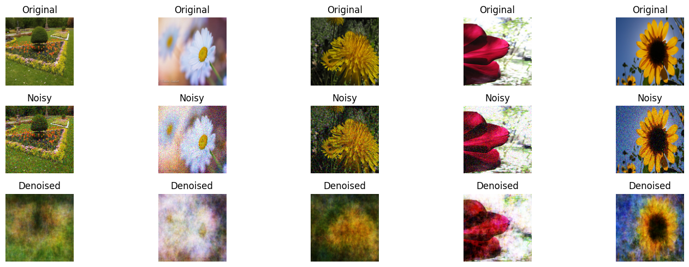
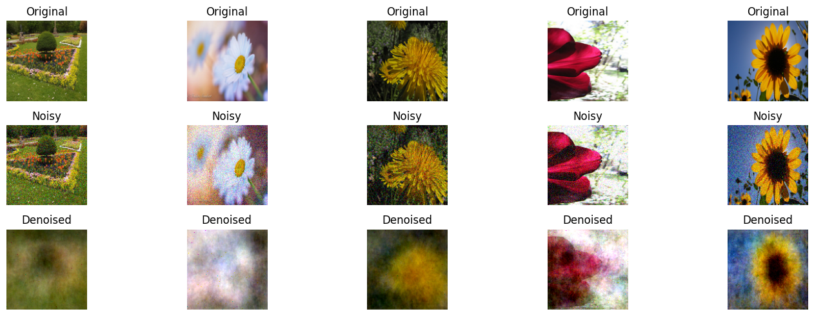
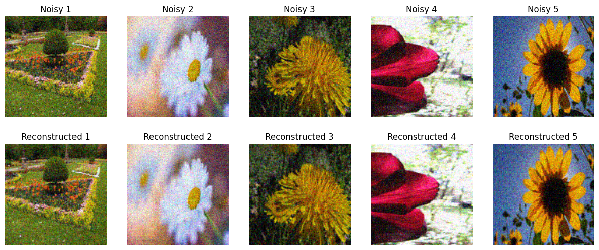
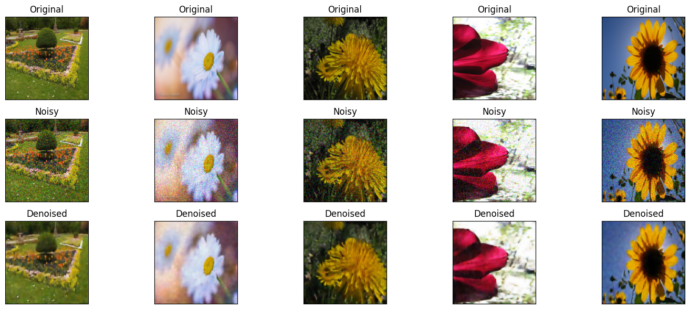

# Image Denoising Using Various Techniques
## Overview
This repository is dedicated to the task of reducing noise in images using an autoencoder specifically designed for RGB images. The main goal is to assess how well the autoencoder performs in various noise addition scenarios, as well as to explore additional features such as Principal Component Analysis (PCA) and Neural Network (NN) as input layers for the encoder, in order to compare their performance with the autoencoder.

## Image Denoising Scenarios
1. **Scenario 2.1: Gaussian Noise on Input Images**
   - Gaussian noise with specified Mu & Sigma is added to original images.
   - Noisy images are fed into the autoencoder and PCA to generate noisy codes.
   - The noisy codes are then mapped back to the original images at the decoder (Noisy images -> Denoised images).

2. **Scenario 2.2: Gaussian Noise on Encoded Code**
   - Gaussian noise with the same Mu & Sigma as in Scenario 2.1 is added directly to the codes generated by the autoencoder and PCA.
   - The noisy codes are mapped back to the same original images at the decoder (Noisy codes -> Denoised images).

## bonus features:

1. **Image Denoising with PCA (4.1)**
   - Utilized Principal Component Analysis (PCA) as an image denoiser.
   - Conducted subjective measures by visualizing denoised images from both autoencoder and PCA.
   - Conducted objective measures by computing compression ratios for both algorithms (Reconstructed image / Original image).

2. **Neural Network as Encoder Input Layer (4.2)**
   - Implemented a Neural Network (NN) as an input layer for the autoencoder.

#### Results Report:

- A comprehensive report is provided, showcasing denoised images, visual comparisons, and additional metrics.
- Results include both subjective and objective evaluations for Scenario 2.1 and Scenario 2.2, along with the bonus features.
- This structure allows for a detailed understanding of the image denoising process using autoencoders, PCA, and NN under various noise addition scenarios.

## Visual comparisons of autoencoders, PCA, and AutoEncoder Model using CNN under the two scenarios:
## AutoEncoder Model results under scenarios 1:

## AutoEncoder Model results under scenarios 2:

## PCA results under scenarios 1:

## PCA results under scenarios 2:

## AutoEncoder Model results using CNN under scenarios 1:

## AutoEncoder Model results using CNN under scenarios 2:

